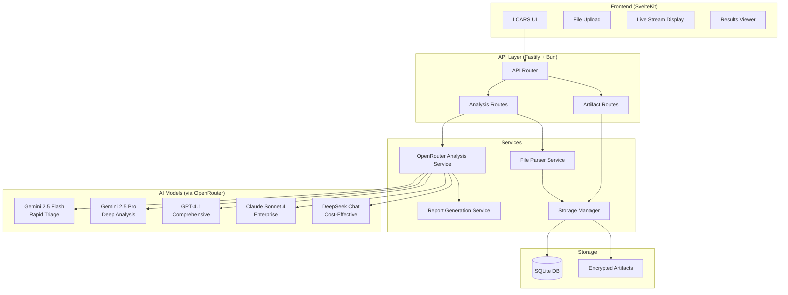

# ForensicAnalyzerPro Architecture

## System Overview

ForensicAnalyzerPro is a sophisticated multi-LLM forensic analysis platform that leverages OpenRouter to orchestrate analysis across multiple AI models, providing comprehensive digital forensics capabilities.

## Architecture Diagram



## Component Details

### Frontend Layer
- **Technology**: SvelteKit + TypeScript + Tailwind CSS
- **Theme**: LCARS Star Trek design system
- **Features**:
  - Multi-file upload with drag-and-drop
  - Real-time SSE streaming display
  - Interactive results visualization
  - Report download (MD/JSON)

### API Layer
- **Technology**: Fastify + Bun runtime
- **Endpoints**:
  - `POST /analyze` - Start multi-model analysis
  - `GET /analysis/:id/stream` - SSE live stream
  - `GET /analysis/:id/status` - Check progress
  - `GET /analysis/:id/results` - Get results
  - `GET /analysis/:id/report` - Download report

### Service Layer

#### OpenRouter Analysis Service
- Orchestrates parallel analysis across models
- Manages model-specific prompts
- Synthesizes consensus findings
- Handles streaming responses

#### File Parser Service
- Supports: JSON, XML, CSV, LOG, TXT, EVTX
- Text extraction and normalization
- Binary file hex dump generation
- Content summarization for large files

#### Storage Manager
- AES-256-GCM encryption
- SQLite metadata storage
- Secure artifact management
- Chain of custody tracking

### AI Model Integration

#### Tier System
- **Free Tier**: Gemini 2.5 Flash only
- **Pro Tier**: All 5 models

#### Model Specializations
1. **Gemini 2.5 Flash**: Rapid triage, initial assessment
2. **Gemini 2.5 Pro**: Deep technical analysis, pattern recognition
3. **GPT-4.1**: Comprehensive analysis, high accuracy
4. **Claude Sonnet 4**: Enterprise reliability, detailed reasoning
5. **DeepSeek Chat**: Cost-effective analysis, good performance

### Data Flow

1. **Upload Phase**
   - User uploads files + optional context
   - Files parsed to text format
   - Content stored encrypted

2. **Analysis Phase**
   - Parallel execution across selected models
   - Real-time streaming from first model
   - Individual artifact generation

3. **Synthesis Phase**
   - Consensus finding identification
   - Conflict resolution
   - Confidence scoring
   - Report generation

4. **Results Phase**
   - Interactive results display
   - Downloadable reports
   - Artifact preservation

## Security Architecture

### Encryption
- At-rest: AES-256-GCM
- In-transit: HTTPS/TLS
- Key management: Environment-based

### Access Control
- API key authentication (OpenRouter)
- CORS configuration
- Input validation & sanitization

### Audit Trail
- Complete activity logging
- Analysis history tracking
- Chain of custody maintenance

## Performance Optimizations

### Parallel Processing
- Concurrent model execution
- Async/await throughout
- Stream processing for large files

### Caching Strategy
- In-memory analysis results
- SQLite for persistence
- Efficient file chunking

### Resource Management
- Token usage tracking
- Request timeout handling
- Graceful error recovery

## Deployment Architecture

### Development
```bash
Frontend: http://localhost:5173
API: http://localhost:4000
```

### Production
- Frontend: Static hosting (Vercel/Netlify)
- API: Container deployment (Docker)
- Database: Persistent volume mount

## Technology Stack Summary

- **Runtime**: Bun
- **Frontend**: SvelteKit, TypeScript, Tailwind CSS
- **Backend**: Fastify, TypeScript
- **Database**: SQLite (Bun native)
- **AI Integration**: OpenRouter API
- **Security**: AES-256-GCM, TLS
- **Monitoring**: Fastify logger
- **Testing**: Bun test framework 