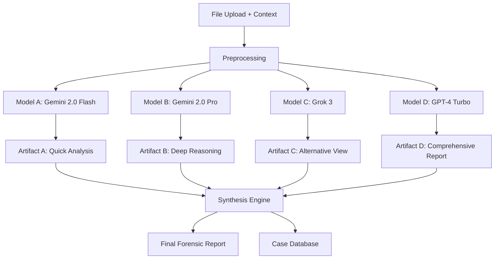

# ForensicAnalyzerPro: Multi-LLM Analysis Engine PRD

## Executive Summary
ForensicAnalyzerPro implements a sophisticated multi-phase analysis workflow using OpenRouter's model routing capabilities to provide comprehensive forensic analysis through diverse AI perspectives.

## Architecture Overview

### Phase 1: Data Ingestion & Preprocessing
- **File Upload Interface**: Drag-and-drop with context field
- **Supported Formats**: M365 logs, audit trails, MSDE investigation packages, event logs
- **Context Collection**: Optional user-provided analysis context
- **Data Validation**: File integrity and format verification

### Phase 2: Multi-LLM Analysis Pipeline

#### Model Routing Strategy
```
Primary Analysis Flow:
1. Gemini 2.0 Flash (Speed + Large Context)
2. Gemini 2.0 Pro (Enhanced Reasoning)
3. Grok 3 (Alternative Perspective)
4. GPT-4 Turbo (Comprehensive Analysis)
```

#### Analysis Workflow


### Phase 3: Analysis Orchestration

#### Model-Specific Prompts
Each model receives:
- **Raw Data**: Original uploaded files
- **Context**: User-provided analysis context
- **Model-Specific Instructions**: Tailored to each model's strengths

#### Artifact Generation
- **Artifact A (Gemini Flash)**: Rapid triage and initial assessment
- **Artifact B (Gemini Pro)**: Deep technical analysis and pattern recognition
- **Artifact C (Grok 3)**: Creative interpretation and anomaly detection
- **Artifact D (GPT-4)**: Comprehensive report with actionable insights

### Phase 4: Synthesis & Reporting

#### Intelligent Synthesis
- **Consensus Building**: Identify areas of agreement across models
- **Conflict Resolution**: Highlight and explain disagreements
- **Confidence Scoring**: Weight findings based on model consensus
- **Evidence Correlation**: Cross-reference findings with source data

## Technical Implementation

### OpenRouter Integration
```typescript
interface ModelConfig {
  name: string;
  provider: string;
  contextWindow: number;
  costPerToken: number;
  speedRating: number;
  qualityRating: number;
}

const ANALYSIS_MODELS: ModelConfig[] = [
  {
    name: "google/gemini-2.0-flash-exp",
    provider: "google",
    contextWindow: 1000000,
    costPerToken: 0.000001,
    speedRating: 95,
    qualityRating: 85
  },
  {
    name: "google/gemini-2.0-pro-exp",
    provider: "google", 
    contextWindow: 2000000,
    costPerToken: 0.000015,
    speedRating: 70,
    qualityRating: 95
  },
  {
    name: "x-ai/grok-3",
    provider: "x-ai",
    contextWindow: 131072,
    costPerToken: 0.000020,
    speedRating: 80,
    qualityRating: 88
  },
  {
    name: "openai/gpt-4-turbo",
    provider: "openai",
    contextWindow: 128000,
    costPerToken: 0.000030,
    speedRating: 75,
    qualityRating: 92
  }
];
```

### Analysis Pipeline
```typescript
interface AnalysisRequest {
  files: FileBuffer[];
  context: string;
  priority: 'speed' | 'quality' | 'cost';
  caseId: string;
}

interface AnalysisArtifact {
  modelName: string;
  timestamp: Date;
  findings: ForensicFinding[];
  confidence: number;
  processingTime: number;
  tokenUsage: number;
}

class ForensicAnalysisEngine {
  async analyzeEvidence(request: AnalysisRequest): Promise<AnalysisArtifact[]> {
    const artifacts: AnalysisArtifact[] = [];
    
    // Process through each model in parallel
    const modelPromises = ANALYSIS_MODELS.map(model => 
      this.analyzeWithModel(model, request)
    );
    
    const results = await Promise.allSettled(modelPromises);
    
    // Handle failures gracefully
    results.forEach((result, index) => {
      if (result.status === 'fulfilled') {
        artifacts.push(result.value);
      } else {
        console.error(`Model ${ANALYSIS_MODELS[index].name} failed:`, result.reason);
      }
    });
    
    return artifacts;
  }
  
  private async analyzeWithModel(
    model: ModelConfig, 
    request: AnalysisRequest
  ): Promise<AnalysisArtifact> {
    const prompt = this.buildPrompt(model, request);
    
    const response = await this.openRouterClient.chat.completions.create({
      model: model.name,
      messages: [{ role: "user", content: prompt }],
      max_tokens: 4000,
      temperature: 0.1
    });
    
    return {
      modelName: model.name,
      timestamp: new Date(),
      findings: this.parseFindings(response.choices[0].message.content),
      confidence: this.calculateConfidence(response),
      processingTime: response.usage?.total_tokens || 0,
      tokenUsage: response.usage?.total_tokens || 0
    };
  }
}
```

## Data Flow Architecture

### Input Processing
1. **File Validation**: Verify file integrity and format
2. **Content Extraction**: Parse structured data (JSON, XML, CSV)
3. **Preprocessing**: Normalize timestamps, sanitize PII
4. **Context Enrichment**: Combine user context with metadata

### Model Orchestration
1. **Parallel Execution**: All models analyze simultaneously
2. **Timeout Management**: Graceful handling of slow responses
3. **Error Recovery**: Fallback strategies for failed models
4. **Resource Management**: Token usage tracking and optimization

### Output Synthesis
1. **Artifact Storage**: Individual model outputs preserved
2. **Consensus Analysis**: Identify common findings
3. **Discrepancy Analysis**: Highlight conflicting interpretations
4. **Final Report Generation**: Unified forensic report

## Case Management System

### Case Structure
```typescript
interface ForensicCase {
  id: string;
  caseNumber: string;
  title: string;
  description: string;
  createdAt: Date;
  
  // Evidence
  evidence: Evidence[];
  
  // Analysis Artifacts
  artifacts: AnalysisArtifact[];
  
  // Synthesis Results
  finalReport: ForensicReport;
  consensus: ConsensusAnalysis;
  
  // Metadata
  analyst: string;
  priority: Priority;
  status: CaseStatus;
}
```

### Database Schema
- **Cases**: Case metadata and relationships
- **Evidence**: Uploaded files and metadata
- **Artifacts**: Individual model analysis results
- **Synthesis**: Combined analysis and final reports
- **Audit Trail**: Complete activity log

## Security & Compliance

### Data Protection
- **Encryption**: All data encrypted at rest and in transit
- **Access Control**: Role-based permissions
- **Audit Logging**: Complete activity tracking
- **Data Retention**: Configurable retention policies

### Compliance Features
- **Chain of Custody**: Immutable evidence tracking
- **Digital Signatures**: Cryptographic verification
- **Export Controls**: Support for legal requirements
- **Privacy Controls**: PII detection and handling

## Implementation Roadmap

### Phase 1: Core Infrastructure (Weeks 1-4)
- [ ] OpenRouter API integration
- [ ] File upload and validation system
- [ ] Basic model orchestration
- [ ] Artifact storage system

### Phase 2: Analysis Pipeline (Weeks 5-8)
- [ ] Multi-model analysis engine
- [ ] Prompt engineering for each model
- [ ] Parallel processing implementation
- [ ] Error handling and recovery

### Phase 3: Synthesis Engine (Weeks 9-12)
- [ ] Consensus building algorithms
- [ ] Conflict resolution system
- [ ] Report generation engine
- [ ] Case management system

### Phase 4: UI/UX & Integration (Weeks 13-16)
- [ ] Analysis dashboard
- [ ] Case management interface
- [ ] Export and sharing features
- [ ] API for external integrations

## Success Metrics

### Performance Metrics
- **Analysis Speed**: < 5 minutes for standard cases
- **Accuracy**: > 95% consensus on critical findings
- **Cost Efficiency**: Optimized model selection
- **Uptime**: 99.9% availability

### Business Metrics
- **Case Resolution Time**: 50% reduction
- **Analyst Productivity**: 3x improvement
- **Cost per Analysis**: 60% reduction
- **User Satisfaction**: > 4.5/5 rating

## Risk Mitigation

### Technical Risks
- **Model Failures**: Multi-model redundancy
- **API Limits**: Rate limiting and queuing
- **Data Loss**: Comprehensive backup strategy
- **Performance**: Horizontal scaling capability

### Business Risks
- **Accuracy**: Human review workflow
- **Compliance**: Regular audits and certifications
- **Vendor Lock-in**: Multi-provider architecture
- **Cost Control**: Budget monitoring and alerts

This PRD provides the foundation for implementing your sophisticated multi-LLM forensic analysis system. The approach leverages the strengths of different models while providing robust error handling and synthesis capabilities. 